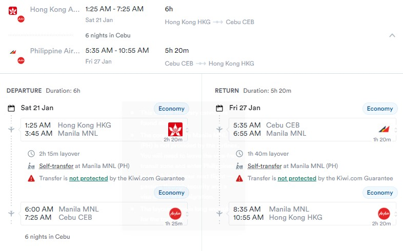

# Cebu - Philippines (Not Philips) 21. Jan. 2023 - 27. Jan 2023 (All public holidays of CUHK)
## Part 1 Introduction to Cebu
Cebu City, known as 宿务(宿雾), is a 1st class highly urbanized city in the Central Visayas region of the Philippines and capital of the Cebu Province.
Cebu is on an island away from Manila. As tourism is a thriving industry in Cebu, there is no need to worry about the security in Cebu. 
You may refer to the Vlog *[宿务旅游攻略2022-1](https://youtu.be/qIB_sNAncQU)* and *[宿务旅游攻略2022-2](https://youtu.be/VCAyanD0o-I)* for latest tourist experiences. 

*Weather*
Nov to May is the dry season of Cebu and it is about 23-30℃.
菲律宾的11月到5月是旱季,气温23到30摄氏度, 需要防晒.

## Part 2 Visa
Visa can be applied easily online 30 days in advance.
官网注明 持有有效的美国签证免签证进入菲律宾7天(need to be confirmed!).

## Part 3 Airline tickets
The ideal flight is shown in the picture. We can fly from HK to Cebu directly. We have 22-26 five whole days to spend in Cebu.

More flights can be got *[here](https://www.cheapflights.com.hk/flight-search/HKG-CEB/2023-01-21/2023-01-27?sort=bestflight_a)*.

## Part 4 Arrangement

| Data | Description | Location| Arrangement|Accomodation|Food|
| --- | ----------- | ---------|----|--|--|
|21 (arrive at Cebu Mactan)| Fly to Cebu and rest| Mactan(麦克坦,机场岛)|Eat and rest|Mactan|.|
| 22 | Go to Bungalows |*[Bungalows(薄荷岛)](https://www.kkday.com/en/product/134610)*|*[Alona Beach, Chotolate Hill](https://www.youtube.com/watch?v=qBrFjzZ9BuM)*|Mactan|.|
| 23 | Kalanggaman Island Day tour from Cebu|*[Kalanggaman(梦幻岛)](https://www.kkday.com/en/product/131154-kalanggaman-island-day-tour-from-cebu-philippines)*|*[White Beach and Snorkelling](https://www.youtube.com/watch?v=_UZbkBpryHs)*|.|.|
| 24 | Take a car to go to Moal Boal 3h|*[Moal Boal(墨宝)](https://www.kkday.com/en/product/11849-private-tour-moalboal-perscador-island-hopping-cebu-philippines)*|*[Dive and watch the storm of Sardines, Jump the Kawasan waterfall](https://www.youtube.com/watch?v=d8XPaP9ODYI)*|Moal Boal|.|
| 25 | Take a car to go to Oslab 2.5h|*[Oslab(欧斯路,鲸鲨村)](https://www.kkday.com/en/product/134610)*|*[Watch Whale Shark](https://www.youtube.com/watch?v=-iaobHU9gCg)*|Dumaguate(杜马盖地)|.|
| 26 | Take a *[boat](https://www.mafengwo.cn/gonglve/ziyouxing/332696.html)* to Siquijor |*[Siquijor(锡基霍尔)](https://www.mafengwo.cn/gonglve/ziyouxing/31566.html)*|Cambugahay Falls and San Isidro Labrador Convent|Fly back to Matan|.|

## Preparations
1. 防水袋
2. 溯溪鞋 (Kawasan waterfall) 需要溯溪爬山路, 跳瀑布. (我们报名私人团会提供头盔和救生衣,导游会搀扶帮助我们), 参照*[这里](https://www.youtube.com/watch?v=d8XPaP9ODYI)*
3. 防晒霜
4. 浮潜的面镜和呼吸管 (墨宝浮潜看海龟,鲸鲨,梦幻岛也可以浮潜,救生衣是免费的)
......

<!--
| Data | Description | Location| Arrangement|Accomodation|Food|
| --- | ----------- | ---------|----|--|--|
|22 and 23| *[Open Water Dive Trainning](https://divefunatics.com/product/open-water-diver-standard/)* |Mactan, Cebu |Learn and get OW certificate with which you can dive up to 18m.|300-400 HKD per night|.|
| 24 | Take a car to go to Moal Boal 3h|Moal Boal|*[Dive and watch the storm of Sardines](https://www.getyourguide.com/cebu-l615/cebu-deep-sea-diving-at-moalboal-and-pescador-island-t325533/)*|Rent a whole house with swimming pool? 980hkd|.|
| 24 | Take a *[boat](https://www.mafengwo.cn/gonglve/ziyouxing/332696.html)* to Dumaguate from Oslab(0.5h)|*[Dumaguate(杜马盖地)](https://www.mafengwo.cn/gonglve/ziyouxing/mdd_29500/)*|Visit the city and Siliman University|.|
| 25 | Take a car to go to Oslab 2.5h|Oslab|*[Jump the Kawasan waterfall and watch Whale Shark](https://www.getyourguide.com/cebu-city-l433/oslob-whale-shark-swimming-and-kawasan-falls-canyoneering-t218004/)*|Rent a whole house with swimming pool?1331hkd|.|
| 26 | Go back to Cebu and travel around |Cebu City|Cebu Taoist Temple/Temple of Leah/ Camotes Island etc.|Wait in the airport unitil 4 to go back to HK|.|-->
