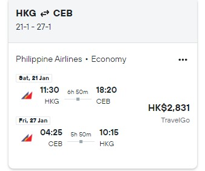

# Cebu - Philippines (Not Philips) 21. Jan. 2023 - 27. Jan 2023
## Part 1 Introduction to Cebu
Cebu City, known as 宿务(宿雾), is a 1st class highly urbanized city in the Central Visayas region of the Philippines and capital of the Cebu Province.
Cebu is on an island away from Manila. As tourism is a thriving industry in Cebu, there is no need to worry about the security in Cebu. 
You may refer to the Vlog *[宿务旅游攻略2022-1](https://youtu.be/qIB_sNAncQU)* and *[宿务旅游攻略2022-2](https://youtu.be/VCAyanD0o-I)* for latest tourist experiences. 

## Part 2 Visa
Visa can be applicated easily online in advance 30 days.

## Part 3 Airline tickets
The ideal flight is shown in the picture. We can fly from HK to Cebu directly. We have 22-26 five whole days to spend in Cebu.

Part 4 Arrangement

| Data | Description | Location| Arrangement|Accomodation|Food|
| --- | ----------- | ---------|----|--|--|
|22 and 23| *[Open Water Dive Trainning](https://divefunatics.com/product/open-water-diver-standard/)* |Mactan, Cebu |Learn and get OW certificate with which you can dive up to 18m.|300-400 HKD per night|.|
| 24 | Take a car to go to Moal Boal 3h|Moal Boal|*[Dive and watch the storm of Sardines](https://www.getyourguide.com/cebu-l615/cebu-deep-sea-diving-at-moalboal-and-pescador-island-t325533/)*|Rent a whole house with swimming pool? 980hkd|.|
| 25 | Take a car to go to Oslab 2.5h|Oslab|*[Jump the Kawasan waterfall and watch Whale Shark](https://www.getyourguide.com/cebu-city-l433/oslob-whale-shark-swimming-and-kawasan-falls-canyoneering-t218004/)*|Rent a whole house with swimming pool?1331hkd|.|
| 26 | Go back to Cebu and travel around |Cebu City|Cebu Taoist Temple/Temple of Leah/ Camotes Island etc.|Wait in the airport unitil 4 to go back to HK|.|
